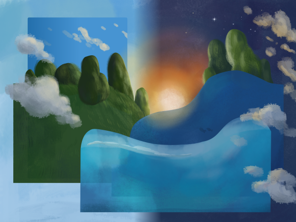

# fedora-kde-dynamic-wallpaper

This is the Fedora 41 wallpaper, converted to a
[plasma5-wallpapers-dynamic](https://github.com/zzag/plasma5-wallpapers-dynamic)
compatible file (AVIF).



## Usage

To use this wallpaper, you must first install the
[plasma5-wallpapers-dynamic](https://github.com/zzag/plasma5-wallpapers-dynamic#fedora)
plugin. Then download the AVIF file from the latest
[release](https://github.com/subpop/fedora-kde-dynamic-wallpaper/releases) and
add it using the Plasma Wallpaper settings. The file is large; roughly 20MB in
size and has a resolution of 4032 x 3024.

## Alternate Usage
Alternatively, you could generate the image file yourself.

1. Install `git-lfs`: `sudo dnf install git-lfs`
2. Clone this repository: `git clone https://github.com/subpop/fedora-kde-dynamic-wallpaper/`
3. Run `kdynamicwallpaperbuilder` (available in the
   [plasma5-wallpapers-dynamic](https://github.com/zzag/plasma5-wallpapers-dynamic)
   project)

The included AVIF file was run with the following command:

```
kdynamicwallpaperbuilder --output f41-dynamic.avif manifest.json
```

## Credit

Artwork by the [Fedora Design Team](https://github.com/fedoradesign/)
